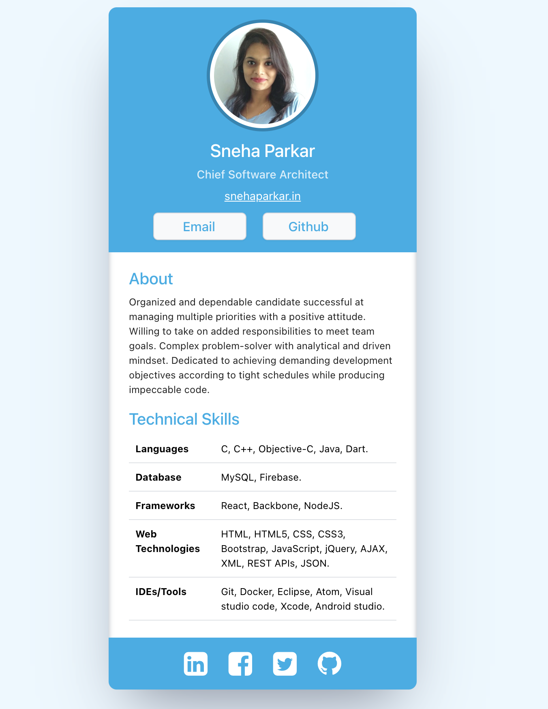

# Digital Business Card  (Scrimba React Course section 1 solo project)

This is a solution to the [Digital Business Card solo project on Scrimba](https://scrimba.com/learn/learnjavascript/).

### Requirements
- Build from scratch!
- Fill in your own information
- Separate components for:
  - Info (photo, name, buttons, etc.)
  - About
  - Skills
  - Footer (social icons)

### Screenshot

### Getting Started with Create React App

This project was bootstrapped with [Create React App](https://github.com/facebook/create-react-app).

## Available Scripts

If you want to see the final project, in the project directory, you can run:

## `npm start`

Runs the app in the development mode.\
Open [http://localhost:3000](http://localhost:3000) to view it in your browser.

### Built with

- Semantic HTML5 markup
- CSS custom properties
- React.JS
- Flexbox

## Author

- Website - [sneha parkar](https://snehaparkar.in)
